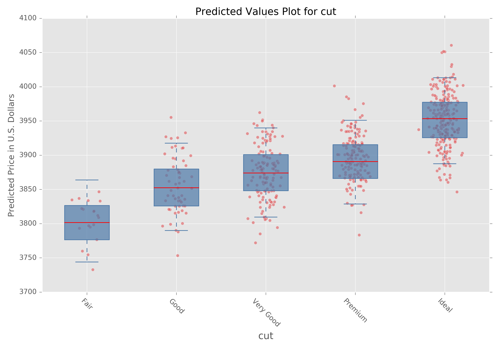
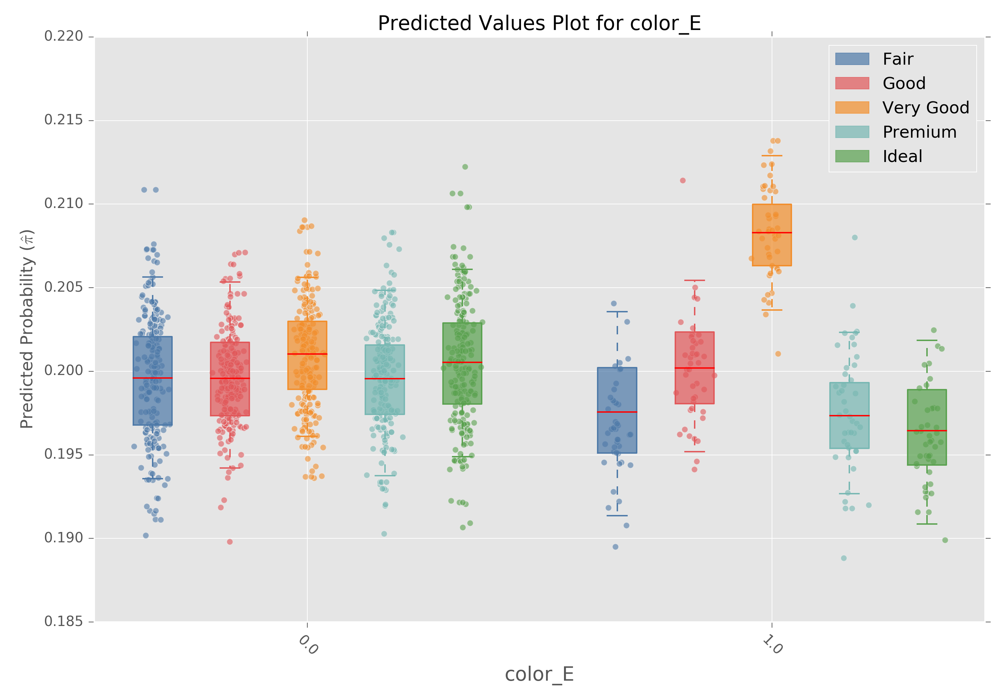
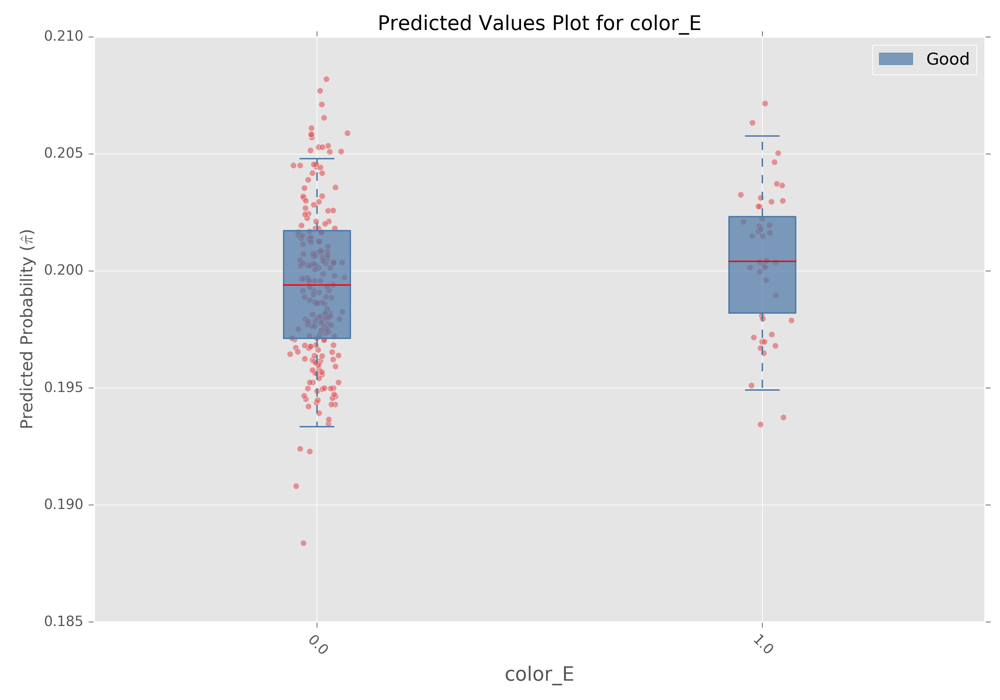
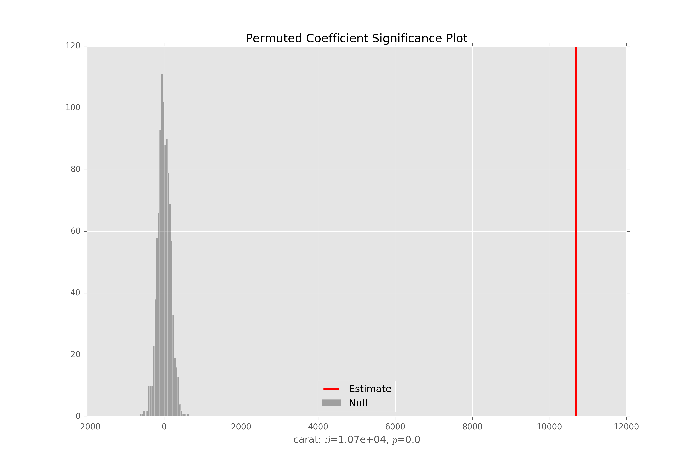
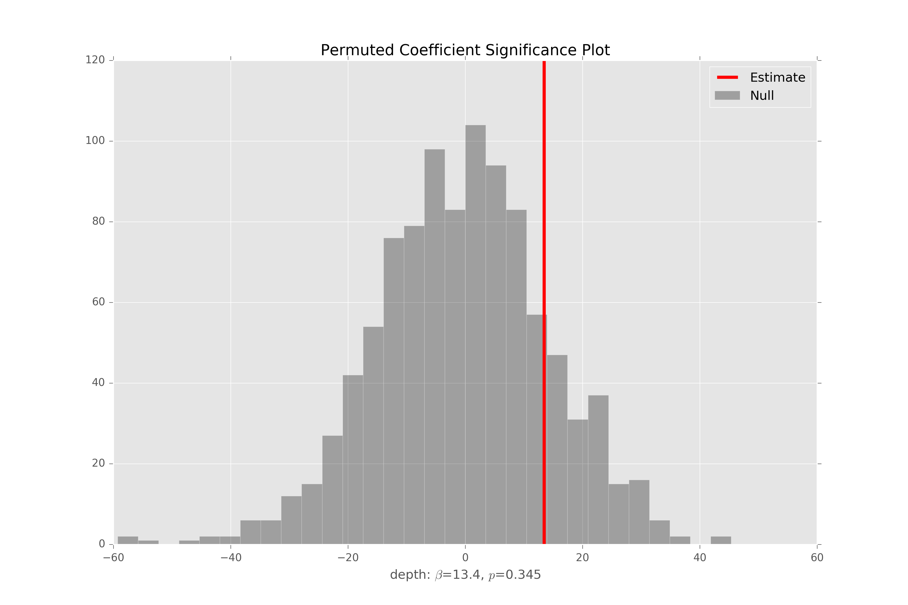

# Random Scripts
This is simply a repository of useful scripts I have written.

## Predicted Value Plot
Script for performing a predicted value plot for a particular feature given a model, dataframe, and column in question.  You can use this script to get a sense for how changing the value of a particular feature will influence your predicted value in the case of regression, or predicted probability in the case of classification.

The following graphic is the resulting plot of using a Random Forest Regressor on the [diamonds dataset](http://docs.ggplot2.org/0.9.3.1/diamonds.html) to identify how different carat values affect the price prediction of a particular diamond.

The function will also work for making predicted value plots for a column containing discrete values; simply pass a `discrete_col=True` argument.  If set, the entire column will be reset to the value of each discrete value and predictions will be made.  The box plot of predictions is then generated from the mean predictions of 1000 bootstrapped samples of those predictions.  There is also an optional parameter for superimposing a jittered scatter plot of bootstrapped means over the box plot (this is turned on by default).

The following graphic is the resulting plot when running the `predicted_value_plot` function on the `cut` column containing discrete values.

This function accommodates classification models to produce predicted probability plots.  Set `classification=True` to indicate that the passed model is a classification model.

Using the same dataset as before, we can build a Random Forest Classifier to predict the `cut` of a diamond.  The following graphic identifies how different values of `price` affect the model's `cut` prediction.

We can also take a look at a discrete column to see how changing that value affects the predicted probabilities of each of our classes.

But maybe we don't want to look at the predicted probability for every class and just want to hone in on a particular class.  We can easily do this by passing in a index to the `class_col` argument.

## Sync Data With S3
Script for keeping data in sync with an S3 bucket.  Useful for keeping data too large for GitHub in sync with a particular S3 bucket by comparing local files to the remote versions to see if the file has changed (using the md5 hash) and re-download accordingly.  Any local files in the chosen directory that aren't contained on S3 will be deleted.  

The end result will be an exact reflection of the state of your S3 bucket.

## Permuted Coefficient Significance

This script is a nice alternative way of calculating p-values for particular beta coefficients in Linear Regression.  It will permute the target values and create a 'null' coefficient a number of times to compare how your original coefficient compares.

The following is an example of a feature that is extremely significant:

The following is an example of a feature that should be dropped from the model due to a high p-value:

